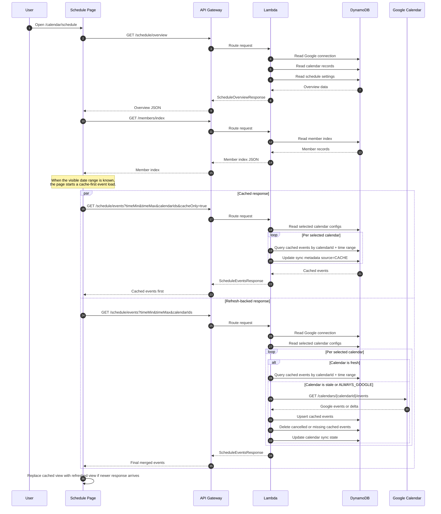
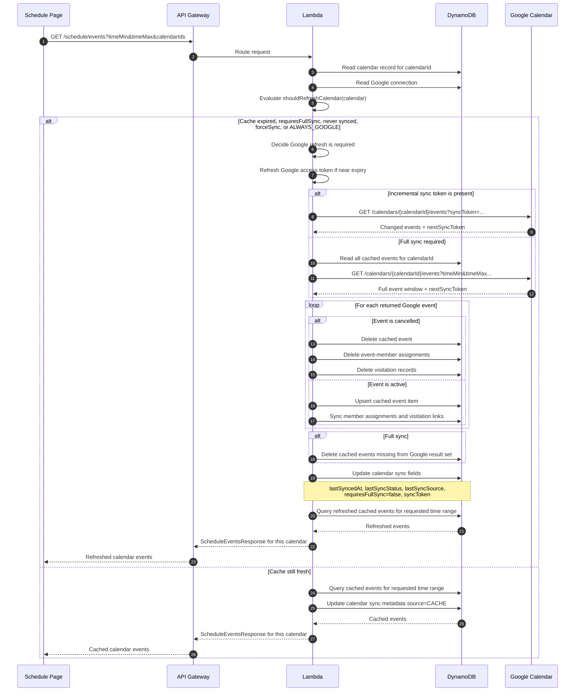

# Shepherd Hub

## Overview

Shepherd Hub is a multi-tenant church operations app built with:

- AWS Amplify Gen 2
- Cognito authentication with email/password sign-in
- API Gateway HTTP API with Cognito authorizer
- Lambda backend
- DynamoDB single-table storage
- React + TypeScript frontend
- Protected routes and authenticated API calls
- A side-menu app shell with shared UI primitives
- Responsive card, table, chart, and right-side drawer patterns

## Included app areas

### 1. Congregation

- Loads members from the protected API
- Supports member creation and Unity import
- Uses the shared page header, dialogs, and state patterns

### 2. Calendar

- Connects to Google Calendar
- Syncs calendars and schedule events through the API
- Supports event creation, editing, and member assignment

### 3. Reports

- Includes a reports dashboard and member visitation views
- Uses cached API data for KPIs, charts, and follow-up workflows
- Shares the same protected routing and shell patterns as the rest of the app

### 4. Admin

- Lets admins manage tenant user groups
- Includes tenant-scoped reset tools with audit logging
- Restricts both page access and backend API access to the `admin` group

## Authentication flow

Frontend auth lives in [src/lib/auth.tsx](/Users/sallysamuel/workspace/amplify-react-template/src/lib/auth.tsx:1).

- Amplify is configured from `amplify_outputs.json` in [src/lib/amplify.ts](/Users/sallysamuel/workspace/amplify-react-template/src/lib/amplify.ts:1).
- `AuthProvider` reads the signed-in user and token claims once from Amplify session APIs.
- `ProtectedRoute` in [src/components/auth/protected-route.tsx](/Users/sallysamuel/workspace/amplify-react-template/src/components/auth/protected-route.tsx:1) blocks unauthenticated access.
- The frontend API client adds the bearer token automatically in [src/lib/api.ts](/Users/sallysamuel/workspace/amplify-react-template/src/lib/api.ts:1).
- The Lambda uses JWT claims from API Gateway authorizer context instead of calling Cognito repeatedly.

## Frontend to backend flow

1. User signs in through Cognito.
2. Amplify stores the session.
3. The frontend calls `api.get/post/put/delete(...)`.
4. `src/lib/api.ts` attaches the bearer token to the request.
5. API Gateway validates the token with the Cognito authorizer.
6. Lambda reads tenant/user/group information from JWT claims.
7. Lambda reads or writes DynamoDB and returns JSON back to the React page.

## Calendar sync sequence diagrams

### 1. Schedule page load



### 2. Single calendar stale-refresh cycle



## Backend structure

Backend infrastructure is defined in [amplify/backend.ts](/Users/sallysamuel/workspace/amplify-react-template/amplify/backend.ts:1).

- Auth: [amplify/auth/resource.ts](/Users/sallysamuel/workspace/amplify-react-template/amplify/auth/resource.ts:1)
- Lambda: [amplify/functions/shepherd-hub-api/resource.ts](/Users/sallysamuel/workspace/amplify-react-template/amplify/functions/shepherd-hub-api/resource.ts:1)
- Lambda handler: [amplify/functions/shepherd-hub-api/handler.ts](/Users/sallysamuel/workspace/amplify-react-template/amplify/functions/shepherd-hub-api/handler.ts:1)
- Table: DynamoDB single table with `PK` and `SK`

Some low-level Amplify/CDK stack and construct identifiers still use legacy names. They are deployment identifiers rather than product-facing names, and changing them may replace cloud resources.

### API routes

- `GET /members`
- `GET /members/index`
- `POST /members`
- `POST /members/import`
- `GET /members/{memberId}`
- `PUT /members/{memberId}`
- `DELETE /members/{memberId}`
- `GET /members/{memberId}/events`
- `GET /events/{eventId}/members`
- `PUT /events/{eventId}/members`
- `GET /schedule/overview`
- `POST /schedule/google/connect`
- `DELETE /schedule/google/connection`
- `POST /schedule/calendars/refresh`
- `PUT /schedule/settings`
- `PUT /schedule/calendars/{calendarId}`
- `POST /schedule/calendars/{calendarId}/sync`
- `DELETE /schedule/calendars/{calendarId}/cache`
- `POST /schedule/sync`
- `DELETE /schedule/cache`
- `GET /schedule/events`
- `POST /schedule/events`
- `PUT /schedule/events/{eventId}`
- `DELETE /schedule/events/{eventId}`
- `GET /admin/users`
- `PUT /admin/users/{username}/groups`
- `POST /admin/reset/{action}`

## Admin groups and reset tools

- Cognito supports `admin`, `priest`, and `servant`.
- Admin-only pages live at `/admin/user-groups` and `/admin/tenant-reset`.
- Frontend visibility is claim-based, but the Lambda also enforces the `admin` group on every `/admin/*` API.
- Tenant user listing comes from Cognito `ListUsers` filtered by `custom:tenantId`, and group changes use Cognito admin group APIs after re-validating the target user belongs to the same tenant.
- Tenant reset actions are always scoped by the tenant id found in JWT claims and write `AUDIT_LOG` records for successful and failed admin actions.

## Validation checklist

1. Ensure Cognito users have the `custom:tenantId` attribute populated and assign at least one admin user to the `admin` group.
2. Visit `/admin/user-groups` as an admin and verify group assignments succeed for another user and that your own `admin` checkbox cannot be removed.
3. Visit `/admin/tenant-reset` and confirm each action requires typing `RESET` before the API call can run.
4. Run a non-destructive reset such as `Delete auditing events` in a test tenant and confirm the response includes deleted counts by entity type.
5. Confirm a non-admin user cannot load either admin page or call `/admin/users` or `/admin/reset/{action}` directly.

## Test commands

- `npm run test:lambda`
- `npm run build`

### DynamoDB shape

The app uses a tenant-aware single-table layout:

- `PK = TENANT#{tenantId}`
- Entity-specific `SK` values such as `MEMBER#{memberId}` and event relationship records

Tenant resolution is claim-based in the Lambda:

- Preferred: `custom:tenantId`
- Fallback: `custom:tenant_id`
- Final fallback: Cognito `sub`

## Reusable frontend pieces

These are the main reusable frontend building blocks:

- `AppShell`: [src/components/layout/app-shell.tsx](/Users/sallysamuel/workspace/amplify-react-template/src/components/layout/app-shell.tsx:1)
- `SideMenu`: [src/components/layout/side-menu.tsx](/Users/sallysamuel/workspace/amplify-react-template/src/components/layout/side-menu.tsx:1)
- `ProtectedRoute`: [src/components/auth/protected-route.tsx](/Users/sallysamuel/workspace/amplify-react-template/src/components/auth/protected-route.tsx:1)
- `PageHeader`: [src/components/common/page-header.tsx](/Users/sallysamuel/workspace/amplify-react-template/src/components/common/page-header.tsx:1)
- `DataGrid`: [src/components/common/data-grid.tsx](/Users/sallysamuel/workspace/amplify-react-template/src/components/common/data-grid.tsx:1)
- `RightSideDrawer`: [src/components/common/right-side-drawer.tsx](/Users/sallysamuel/workspace/amplify-react-template/src/components/common/right-side-drawer.tsx:1)
- `FormDrawer`: [src/components/common/form-drawer.tsx](/Users/sallysamuel/workspace/amplify-react-template/src/components/common/form-drawer.tsx:1)
- `StatusBadge`: [src/components/common/status-badge.tsx](/Users/sallysamuel/workspace/amplify-react-template/src/components/common/status-badge.tsx:1)
- `ConfirmDialog`: [src/components/common/confirm-dialog.tsx](/Users/sallysamuel/workspace/amplify-react-template/src/components/common/confirm-dialog.tsx:1)
- `EmptyState`: [src/components/states/empty-state.tsx](/Users/sallysamuel/workspace/amplify-react-template/src/components/states/empty-state.tsx:1)
- `LoadingState`: [src/components/states/loading-state.tsx](/Users/sallysamuel/workspace/amplify-react-template/src/components/states/loading-state.tsx:1)
- `ErrorState`: [src/components/states/error-state.tsx](/Users/sallysamuel/workspace/amplify-react-template/src/components/states/error-state.tsx:1)

## How to add a new page

1. Create a page component under `src/pages/`.
2. Add a route in [src/routes/router.tsx](/Users/sallysamuel/workspace/amplify-react-template/src/routes/router.tsx:1).
3. If needed, add a page title/breadcrumb mapping in [src/lib/route-metadata.ts](/Users/sallysamuel/workspace/amplify-react-template/src/lib/route-metadata.ts:1).
4. Add a menu item in `SideMenu`.

## How to add a new side menu item

Edit the `buildNavigation` function in [src/components/layout/side-menu.tsx](/Users/sallysamuel/workspace/amplify-react-template/src/components/layout/side-menu.tsx:1).

Each item needs:

- `label`
- `href`
- optional `icon`

## How to add a new grid

1. Build your page data loader.
2. Define columns with `DataGridColumn<T>`.
3. Render `DataGrid` with:
   - `columns`
   - `rows`
   - `getRowKey`
   - empty-state text

See [src/pages/members-page.tsx](/Users/sallysamuel/workspace/amplify-react-template/src/pages/members-page.tsx:1) for a reference pattern.

## How to add a new right-side drawer form

1. Keep open/close state in the page.
2. Use `FormDrawer` for editable flows.
3. Use `RightSideDrawer` for view-only details.
4. Keep the form state local to the page unless multiple pages need the same form.

The members page demonstrates:

- create dialog
- import dialog
- list refresh flow
- API error handling

## How to add a new Lambda CRUD route

1. Add the route in [amplify/backend.ts](/Users/sallysamuel/workspace/amplify-react-template/amplify/backend.ts:1).
2. Add the handler branch in [amplify/functions/shepherd-hub-api/handler.ts](/Users/sallysamuel/workspace/amplify-react-template/amplify/functions/shepherd-hub-api/handler.ts:1).
3. Add shared request/response types in [shared/types.ts](/Users/sallysamuel/workspace/amplify-react-template/shared/types.ts:1).
4. Call the route from the frontend through `src/lib/api.ts`.
5. Add or update Lambda tests in `tests/`.

## Environment variables

### Frontend

- `VITE_API_BASE_URL`
  - Optional when `amplify_outputs.json` already contains the generated API endpoint
  - Useful for local overrides

### Backend

- `SHEPHERD_HUB_RECORDS_TABLE`
  - Set automatically by Amplify for the Lambda

Optional JWT claims for tenanting:

- `custom:tenantId`
- `custom:tenant_id`

## Local development

Install dependencies:

```bash
npm install
```

Start Amplify sandbox:

```bash
npx ampx sandbox
```

Regenerate outputs after sandbox or deploy:

```bash
npx ampx generate outputs
```

Start the React app:

```bash
npm run dev
```

Run verification:

```bash
npm run build
npm run test:lambda
```

## Notes

- `amplify_outputs.json` must be regenerated after creating a fresh sandbox or deploy.
- A few low-level Amplify/CDK identifiers still use legacy names to avoid unintended infrastructure replacement during deployment.
